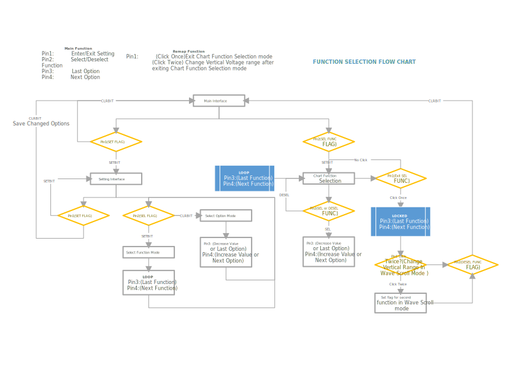

# :rocket: MiniScope on STC8A8K64S4A12

  
I want to use this **MiniScope** project to learn embedded system. I imitate [Open-ELL/MiniDSO-Pro](https://gitee.com/open-ell/mini-dso-pro) to make a **MiniScope** on my own but the hardware and software seems not suitable for me on account of self-changes. I have written a convenient system library for _STC8x_ easy usage. Currently I only finish the _STC8Ax_ and _STC8Hx_(mainly based on _STC8A8K64D_).

## Test Recorder
- [x] ADC Inquiry Method
- [x] ADC `VBAT` Module
- [x] UARTx Module
- [ ] External Interrupt 0 and 1
- [x] TM0 and TM1 for keys scanning and VBAT information update
- [x] EEPROM Module
- [x] SSD1306 OLED
- [x] Setting options selection
- [x] Chart options selection
- [x] Wave scroll options selection
- [ ] Run/Stop function (Lack of buttons)

**NOTE: EC11 external Interrupt seems wrong. I think this may cause by hardware design or the EC11 device itself.**

## Planning
Current version cannot perform the waveform sampling function. SMD buttons will substitute the EC11 encoder.

- [ ] Design a new PCB
- [ ] Single EC11 test
- [ ] Update UI 
- [ ] Make MiniScope run

## Functions Selection Flowchart

> Reference: [Open-ELL/MiniDSO-Pro](https://gitee.com/open-ell/mini-dso-pro)