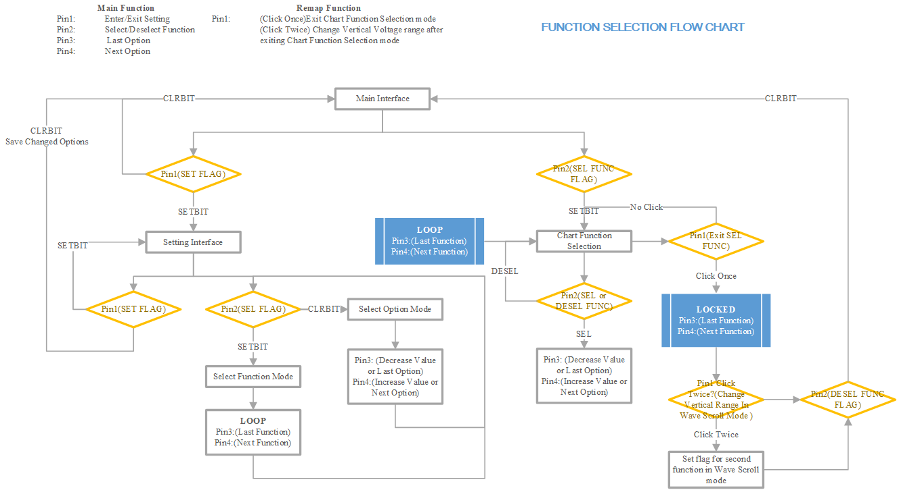

# :rocket: MiniScope on STC8A8K64S4A12
I want to use this **MiniScope** project to learn embedded system. I imitate [Open-ELL/MiniDSO-Pro](https://gitee.com/open-ell/mini-dso-pro) to make a **MiniScope** on my own but the hardware and software seems not suitable for me on account of self-changes. I have written a convenient system library for _STC8x_ easy usage. Currently I only finish the _STC8Ax_ and _STC8Hx_(mainly based on _STC8A8K64D_).

## Test Recorder
- [x] ADC Inquiry Method
- [x] ADC `VBAT` Module
- [x] UARTx Module
- [ ] External Interrupt 0 and 1
- [x] TM0 and TM1 for keys scanning and VBAT information update

**EC11 external Interrupt seems wrong. I think this may cause by hardware design or the EC11 device itself.**

## Functions Selection Flowchart

> Reference: [Open-ELL/MiniDSO-Pro](https://gitee.com/open-ell/mini-dso-pro)